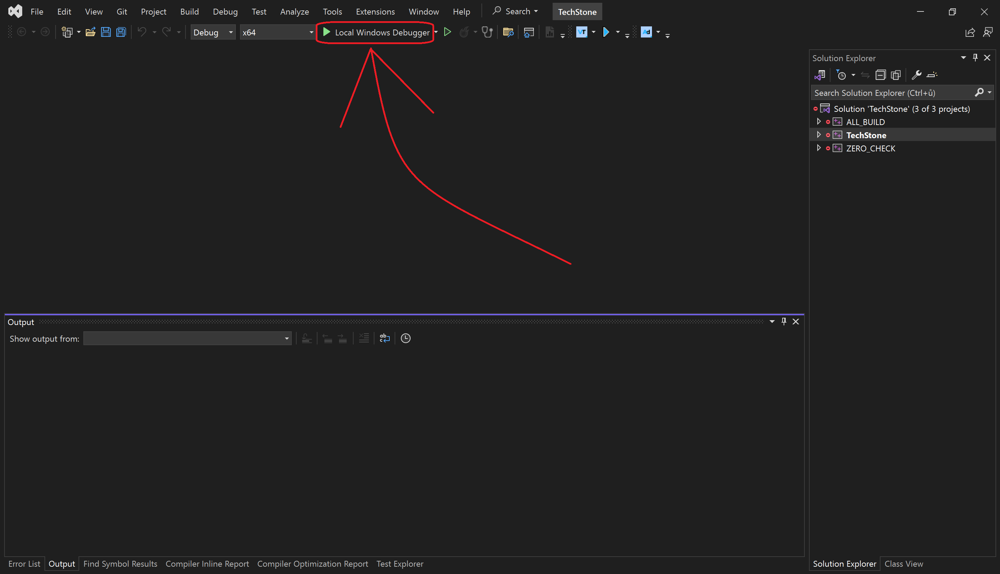
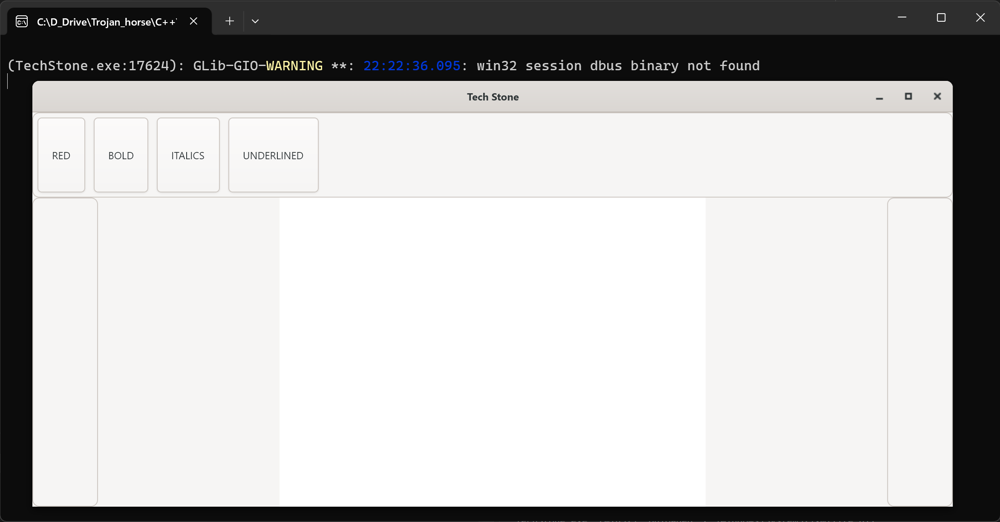
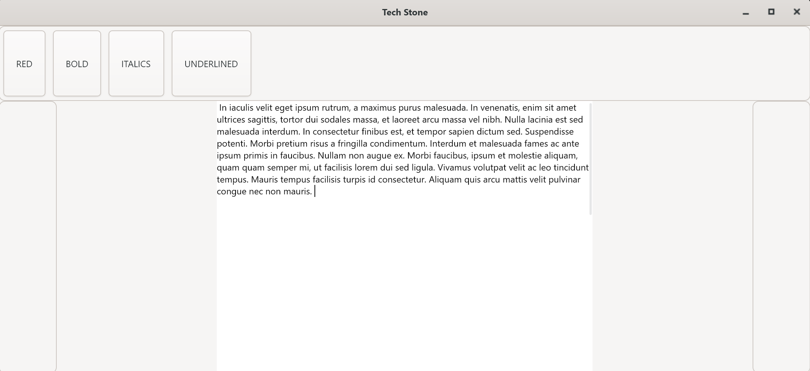
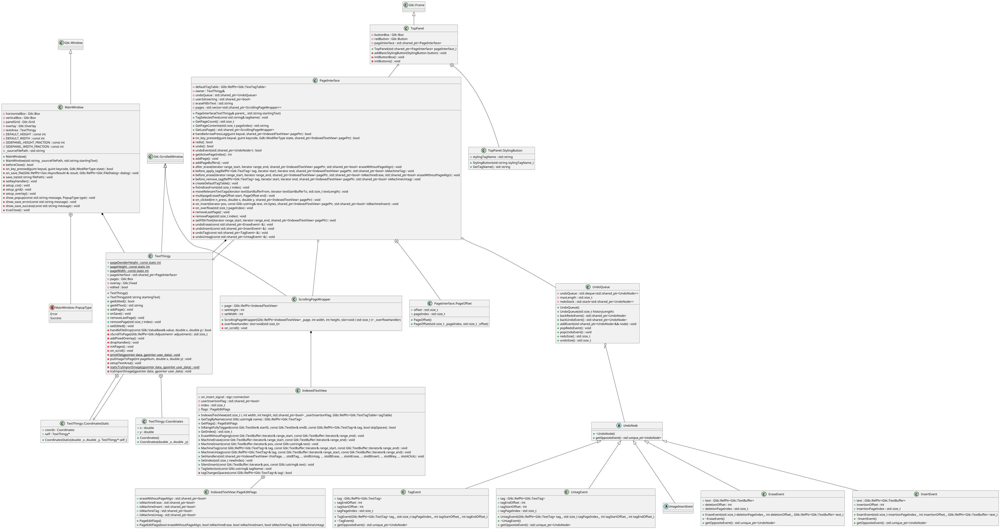

# Documentation
This was a school project gone wrong, also UI is not my passion. Still some ok code to show off i guess. 

## Compilation guide:

On Linux (Proven to work in Fedora 40 docker container and in Ubuntu 22.04 docker container):
1. Clone the vcpkg repository (https://github.com/microsoft/vcpkg.git). I strongly recommend to clone vcpkg into a directory with a short path, the compilation might otherwise fail! (There are some loong commands being generated and windows currently allows max length of commands 8191.......)
2. In compile.sh, set the VCPKG_ROOT variable to the full path of the previously cloned repository
3. Run `sudo ./install_linux_pkgs.sh` or install the packages specified inside by hand
4. Run `./compile.sh`
5. (In the root directory of this project a Makefile should appear. Then you can just run make and editorMain will be created, which you can simply run)

On Windows (Proven to work in Windows 10 Virtual Machine and also works on my own Windows 11 PC):
1. Install Visual Studio with the "Desktop Development with C++" workload
2. Install CMake
3. Clone the vcpkg repository (https://github.com/microsoft/vcpkg.git)
4. In compile.sh, set the VCPKG_ROOT variable to the full path of the previously cloned repository
5. Run compile.sh in Git Bash simply using `./compile.sh`
6. (Then you can open the generated .sln file in Visual Studio and happily so whatever you wanted to do)

If you examine the compile.sh file, you'll find that it will install some X libraries using the Ubuntu/Fedora default package manager. Why not use VCPKG? I've tried it and it's not only a bit of a hassle (one must set an enviroment variable in the triplet cmake file), still libXcursor has no VCPKG replacement and then, when everything finally compiles, cmake throws a warning at the user. I'm not sure what the warning means or how difficult it is to solve. But what was obvious was that using apt/dnf for these development libraries is just easier and probably will result in less unexpected behaviour in the future.

## User documentation
### Minimal hardware requirements
- RAM - 2GiB RAM (More recommended for Windows)
- CPU - Any ok CPU with more than two core
- GPU - any
- Storage space - with vcpkg 8.5GiB, only project 350MiB, only binary with needed dlls 75MiB

### Software requirements
- Windows 10, 11 or Linux (Fedora 40 and Ubuntu 22.04 proven to work)

### Instalation steps and how to run it
- First compile the project using the guide above. Then:
- Linux 
  - Run `make ` in the same directory you've ran `cmake` in.
  - Run `./TechStone` and enjoy.
- Windows
  - Open the generated `.sln` file using Visual studio and run with "Local windows debuger". Should look something like this in VS2022 (night mode):
  
  This will build the project and immediately run it
Upon running, the application should look something like this (in light mode):
  

Then anytime you want to run the application, you can just run the generated TechStone(.exe) like you would with any other program.

### Basic usage
This is a simple text editor for when you just need to quickly save some text with some very basic formatting options. It is not suppossed to be used for big projects that require LateX or similar.

Run TechStone and copy into it the text from `example.txt` (present in the same directory) using ctrl + C and ctrl + V. You can also just run `TechStone example.txt` in the command line and you will edit that file directly. You should see approximately this: 

The top menu of the editor contains some buttons. These work very simply, they edit the highlighted text appropriately (their function should be obvious from their names). If you press them with nothing highlighted, nothing will happen.

Some functions do not have a button, they are instead used by key shortcuts. Here is a list of them:
- Ctrl+Z = Undo
- Ctrl+Y = Redo
- Ctrl+S = Save (for now sadly doesn't save formatting)

## Programmer documentation

### UML Diagram

You can find the image of this diagram in the UML folder, if it's perhaps too small in this markdown document.

To generate doxygen, enter the project "src" directory and run `doxygen Doxyfile`. Then the "html" and "latex" directories should appear, in which you probably know what you are looking for.

I am not aware of any used design patterns. I'm sure gtkmm uses heavily the Observer design pattern and perhaps I am therefore using it too? Inheritence is a must when working with these tools, so almost everything inherits from a Gtkmm widget of some sort. I think the only interesting construct is in UndoQueue, which stores UndoNodes. This UndoNode is an abstract class that might be any event that the user has done. The only thing a class must implement to be undoable is to create an opposite event to itself (for redo). If there is an unredoable event in the future (which is unlikely in a text editor, but possible), it should still be simple to implement.

PageInterface has a lot of code bloat, because most of the development was made with multiple pages in mind (kind of like they are in word), but I wasn't able to make it work with gtkmm4. Thankfully I am the best programmer in the world and turning off paging was as easy as commenting out a line. You can find this line in ScrollingPageWrapper, on_scroll function. Be warned, if you uncomment this line, undo might break (and, of course, everything else too, but Undo is the most probable function to break). This is also the reason pages are represented as (in gtkmm4 structures +- meaning) a scrollable widget with a TextField, rather than just textfield. The key tool for the job of paging was Pango::Layout, which should give me the text measurement without needing to render it to the user, but I couldn't get it to work consistently. Once they fix it (or I get smarter), I want to keep everything in the code. If nothing else, it at least serves as a reminder that I should consider I have multiple pages when implementing something new.

Gtkmm4 heavily uses signal handlers for everything, so to get yourself oriented in the code, I recommend finding those in each widget (usually you can search for `.connect(`, in PageInterface it's in the addPageBuffers function) and look at these handlers. They should give you an ok idea of how everything is done (but keep in mind if some code seems useless, it's because there used to be more than one page). To be brief, there is not much going on in the erase or insert handlers except recording events for the UndoQueue. Editing text appearance is done through Gtk text tag system.

